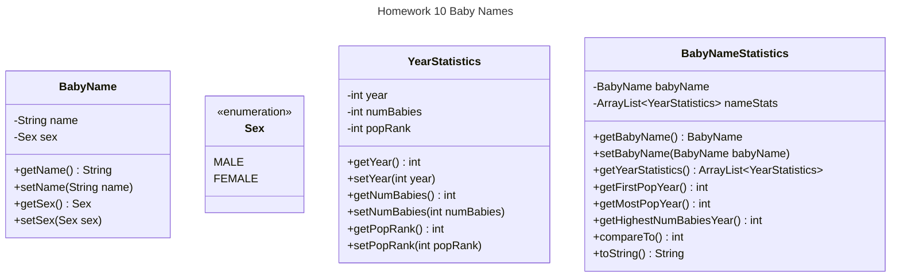

```mermaid
---
title: Homework 10 Baby Names
---
classDiagram
direction TD

	class BabyName {
		-String name
		-Sex sex
		+getName() String
		+setName(String name)
		+getSex() Sex
		+setSex(Sex sex)
	}
	
	class Sex {
		<<enumeration>>
		MALE
		FEMALE
	}
	
	class YearStatistics {
		-int year
		-int numBabies
		-int popRank
		+getYear() int
		+setYear(int year)
		+getNumBabies() int
		+setNumBabies(int numBabies)
		+getPopRank() int
		+setPopRank(int popRank)
	}
	
	class BabyNameStatistics {
		-BabyName babyName
		-ArrayList~YearStatistics~ nameStats
		+getBabyName() BabyName
		+setBabyName(BabyName babyName)
		+getYearStatistics() ArrayList~YearStatistics~
		+getFirstPopYear() int
		+getMostPopYear() int
		+getHighestNumBabiesYear() int
		+compareTo() int
		+toString() String
	}
```

